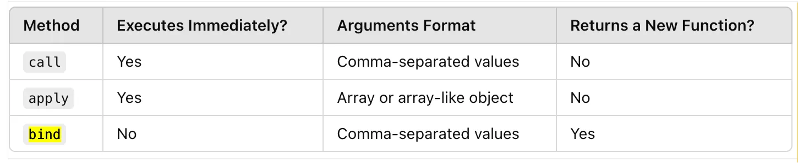

## Call, Bind and Apply
### Parameter
when you define a function

### Argument
when you call a function and pass argument into it

### When do we use call, bind or apply ?
- Borrowing a function from object and can be used for another object without actually adding into it
It will change the context of `this` to provided object.
### call
- Immediately calls a function
- explicitly sets the value of this
- passing arguments one by one.
- Use case: When you want to invoke a function and specify a custom value for this, passing arguments one by one.
###  apply
when we want to borrow a method only once with n number of parameters.

- Same as call
- passing arguments as array form.
- Use case: When you want to invoke a function with a specific this value and arguments in array form.

```js
const obj1 = { name: "Alice" };
const obj2 = { name: "Bob" };

function introduce(age) {
  console.log(`Hi, my name is ${this.name} and I am ${age} years old.`);
}

introduce.call(obj1, 25); // Hi, my name is Alice and I am 25 years old.
introduce.apply(obj2, [30]); // Hi, my name is Bob and I am 30 years old
```

### bind
- Creates a new function with a specific this value
- (optionally) pre-specified arguments.
- Unlike call and apply, it does not immediately invoke the function.
- Instead, it returns a new function that can be called later
- Use case: When you want to set this for a function but call it later.
```js
const person = {
  name: "Charlie",
  sayHello() {
    console.log(`Hello, my name is ${this.name}.`);
  },
};

const greet = person.sayHello.bind(person);
setTimeout(greet, 1000); // Output: Hello, my name is Charlie.
```
