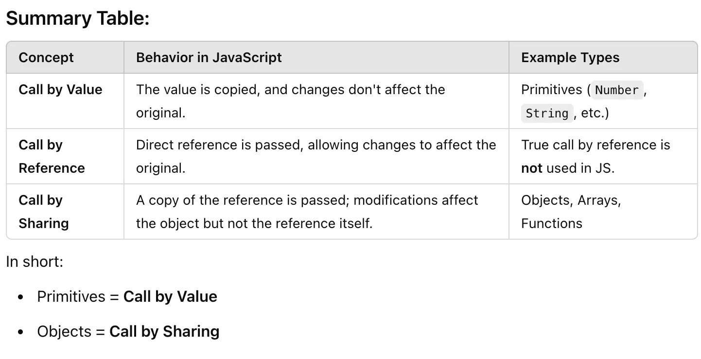

## Call by Sharing or Call by Value or Call by Reference
In JavaScript, function arguments are neither strictly “call by value” nor “call by reference.” Instead, JavaScript uses a mechanism often called call by sharing (or sometimes call by value for primitives and call by reference for objects)

### Why “Call by Sharing”?
The term “call by sharing” emphasises that the function receives a copy of the reference (for objects) rather than the object itself. While you can modify the shared object, reassigning the reference does not affect the original variable.

### Call by Value
- A copy of the value is passed to the function.
- Any changes made to the parameter inside the function do not affect the original variable outside the function.
- In JavaScript, primitive types (e.g., Number, String, Boolean, Symbol, BigInt, undefined, null) are passed by value.

```js
function modifyPrimitive(x) {
x = x + 1; // Modify the copy
}
let num = 5; // Original value
modifyPrimitive(num);
console.log(num); // Output: 5 (unchanged)
```

### Call by Reference

- A reference to the actual memory location is passed to the function.
- Any changes made to the parameter inside the function directly modify the original variable.

JavaScript **does not use true call by reference** because, for objects, it passes a copy of the reference (not the actual object). However, you can modify the object’s properties because the reference still points to the same object.

```js
function modifyObject(obj) {
obj.key = "new value"; // Modifies the original object
}
const myObj = { key: "original value" };
modifyObject(myObj);
console.log(myObj.key); // Output: "new value"
```

### Key Distinction: Why It’s Not True Call by Reference

If JavaScript had true **call by reference**, you’d be able to reassign the object or variable itself inside the function, and that reassignment would affect the original variable outside the function. However, this is not the case.

```js
function reassignObject(obj) {
obj = { key: "another value" }; // Reassigns the parameter, but doesn't affect the original object
}
reassignObject(myObj);
console.log(myObj.key); // Output: "new value" (unchanged)
```

Here, the reassignment of obj inside the function does not affect myObj outside the function because the reference itself is passed **by value** (a copy of the reference).

