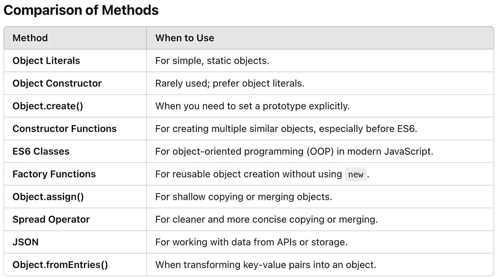

### Different Ways To Create Object
#### 1. Object literal
Simplest way to create an object is using the {} syntax
```js
const person = {
 name: "Harry",
 age: 25,
 greet: function () {
 console.log(`Hello, my name is ${this.name}`);
 }
};
```
#### 2. Factory Function
It is is a function that returns an object. Same type of object with different parameters.
```js
function FactoryPerson(fN, lN) {
  return {
    firsName: fN,
    lastName: lN,
    printFullName: function () {
      console.log(this.firsName, this.lastName);
    },
  };
}
const fPerson1 = FactoryPerson("Sri", "Jay");
const fPerson2 = FactoryPerson("Pratik", "Nivas");
```
#### 3. Constructor Function
Name of function should be starting with capital letter.
```js
function ConstrutorPerson(fN, lN) {
  this.firsName = fN;
  this.lastName = lN;
  this.printFullName = function () {
    console.log(fN, lN);
  };
}
const constructorPerson1 = new ConstrutorPerson("Sri", "Jay");
const constructorPerson2 = new ConstrutorPerson("Pratik", "Nivas");
```
#### 4. new Object
The object constructor creates an empty object that can be populated with properties.
```js
const person = new Object();
// oPerson : {}
person.firsName = "Harry";
person.lastName = "Naryan";
person.printFullName = function () {
  console.log(firsName, lastName);
};
person.printFullName();
```
#### 5. Object.create()
This method creates a new object with a specified prototype object.
```js
const objCreate1 = Object.create(null); // [[Prototype]] will be not there, 
// beacuse it is null
objCreate1.firsName = "Harry";
objCreate1.lastName = "Naryan";
const fn = function () {
  console.log(this.firsName, this.lastName);
};
const objCreate2= Object.create(fn.prototype); // fn.prototype is object,
//objCreate2.[[Prototype]] will be Object.
objCreate2.firsName = "Harry";
objCreate2.lastName = "Naryan";
```
#### 6.Object.assign()
This method creates an object by copying properties from one or more source objects
```js
const person = Object.assign({}, { name: "Grace", age: 32 });
console.log(person); // Output: { name: 'Grace', age: 32 }
```
#### 7.Spread Operator
The spread operator (...) is a way to copy or combine objects
```js
const baseObject = { age: 50 };
const person = { ...baseObject, name: "Hank" };
console.log(person); // Output: { age: 50, name: 'Hank' }
```
#### 8. ES6
Classes are syntactic sugar over constructor functions.
```js
class Person {
  constructor(fN, lN) {
    this.firstName = fN;
    this.lastName = lN;
  }
  printFullName = function () {
    console.log(this.firstName, this.lastName);
  };
}
const PersonClass = new Person("Varsha", "Gourav");
console.log(PersonClass);
PersonClass.printFullName();
```
#### 9.JSON
Create objects by parsing JSON strings.
```js
const jsonString = '{"name": "Ivy", "age": 45}';
const person = JSON.parse(jsonString);
console.log(person);
```

