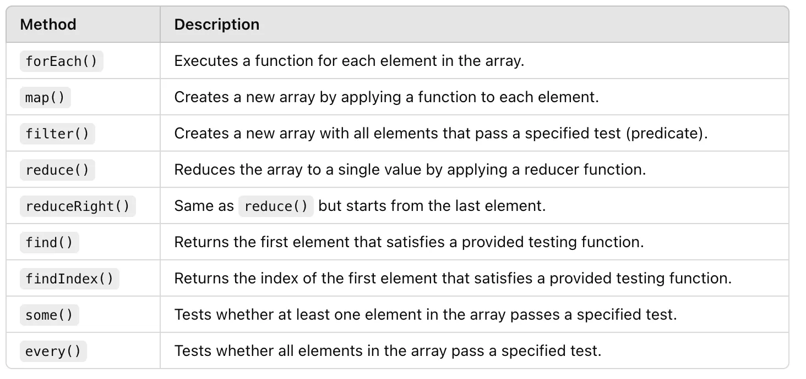
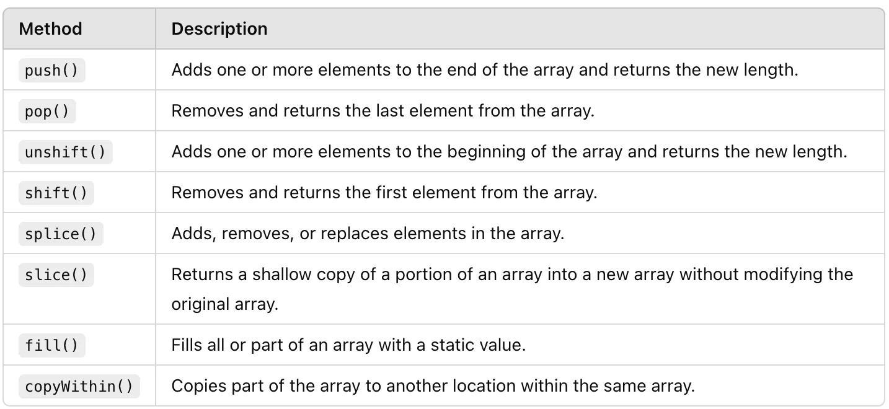
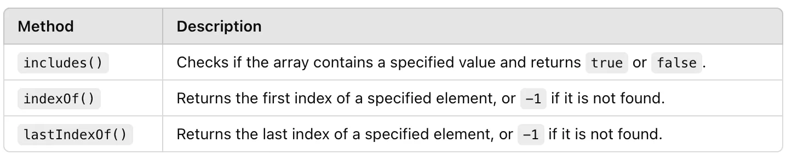
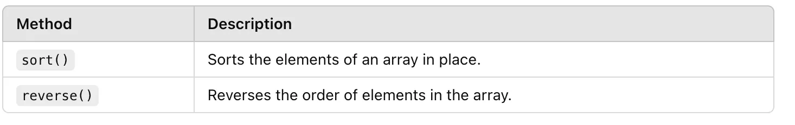
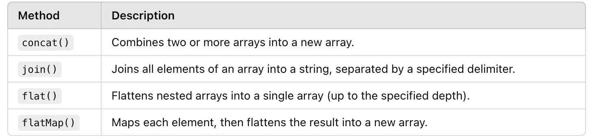
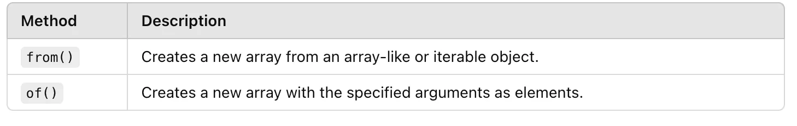
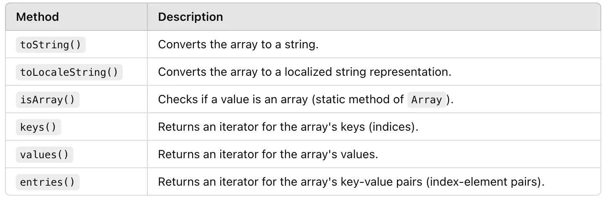
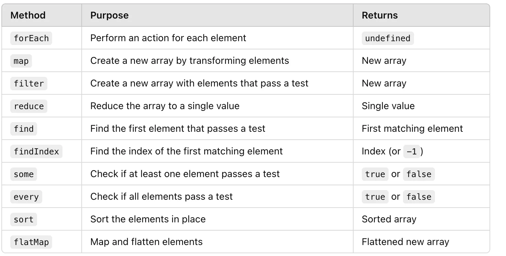

### Array methods in glance
#### 1. Iteration and Looping

#### 2. Adding, Removing, and Modifying Elements

#### 3. Searching and Checking

#### 4. Sorting and Reversing

#### 5. Combining, Splitting, and Flattening

#### 6. Creating New Arrays

#### 7. Utility Methods

#### Higher Order Function
When a function either receives a function or return a function that particular function is called as higher order function.
Example: **HOF list of array**

