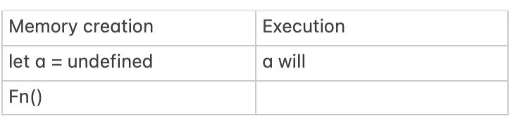
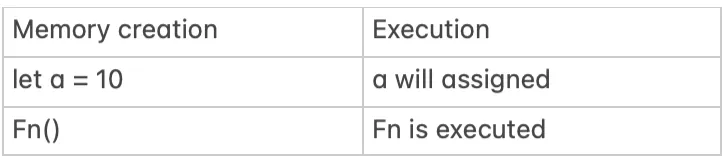
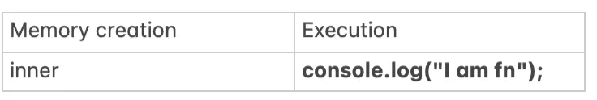
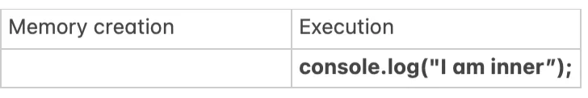

## Execution Context
Whenever a function is called in JavaScript, it creates a new **Execution Context**, which consists of two main parts:

### 1. Memory Creation 
- During the creation phase, all variables are initialised with undefined, and functions are fully hoisted (function definition is stored in heap).
- Variables declared with var are hoisted and initialized as undefined.
- Variables declared with let and const are also hoisted, but they remain in the Temporal Dead Zone (TDZ) until they are assigned a value.
- Function declarations are fully hoisted, meaning their definitions are available even before they are executed.
### 2. Execution 
- During the execution phase, JavaScript runs the code in the function body step by step.
- Variables are assigned their values when the line of code assigning them is executed.
- Any function calls within the function create their own new execution contexts.
```js
let a=10
function fn() {
 console.log("I am fn"); // 1
  function inner() {
   console.log("I am inner"); // 2
   } 
  inner(); 
}
fn();
```
#### Step 1 — fn() execution context created

#### Step 2 execution context executed

#### Step 3 — inner() has own execution context created

#### Step 4— inner() has own execution context executed


```js
I am fn
I am inner
```

### Functions definitions are stored in the heap
In JavaScript, when multiple functions are declared with the same name in the same scope, the last defined function “overwrites” the previous ones. This happens because **functions are stored in the heap** (a part of memory for storing objects and functions) and are **reinitialised during the memory creation phase of execution context.**

```js
function real() {
    console.log("I am real. Always run me");
}
function real() {
    console.log("No I am real one ");
}
real();
function real() {
    console.log("You both are faked");
}

output: You both are faked
```