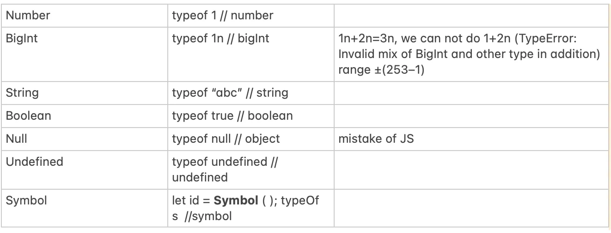

## JavaScript

### What is JavaScript?
JavaScript, unlike Java, is a dynamically typed (Its dynamic nature allows variables to change types during runtime, offering flexibility in coding).It is commonly used in web development. It is written in C++.

### How does JavaScript execute?
JS can execute in any device that has JS Engine like server, browser. Browser that has embedded engine sometimes called JS virtual machine. Example:"Chrome " for V8, "Firefox" for spider mankey, "Chakra" for IE, "JavaScriptCore", "Nitro" and "SquirrelFish" for Safari

### How engine works?
- Engine(embedded in browser) parses the script.
- Then converts into machine code.
- The machine works very fast

### JavaScript Files
- Always end with the js extension
- Only include JavaScript

### How do we include JS in html file?
- <script> tag is what we use to includes our JavaScript.

- Inside head or body, add 
```js
<script type="text/javascript" src="path-to-javascript-file.js"></script>
```
OR add
```js
<script type="text/javascript">console.log("test");</script>
```

- Script attribute src is used for source of file.

- Simplest JS logic kept into html file. But complex JS files reside in separate file, so that browser will download and cache it. Other pages who uses same script, browser use it from cache rather than again downloading it.

###  Important Rules
1. A single <script> tag can’t have both the src attribute and code inside.This won’t work. It should have either code or src.

```js
<script src="file.js">
    alert(1) // the content is ignored, because src is set
</script>
```
2. We recommend putting semicolons between statements even if they are separated by newlines. This rule is widely adopted by the community.

3. Nested comments are not supported! 
```js
<!-- This <!-- is not allowed --> nested comment -->
```

### How “use script” came into a picture ?

Before ES5 (until 2009), if JS developer has taken wrong decision. It was there in JS. Then introduced **use strict**.

### Should we include statement *use strict* ?

**use strict;** is a welcome guest at the top of our scripts. But if JavaScript code has included **classes** and **modules** etc that enable **use strict automatically**. In that case we can **omit** it.


### Variable 
Variable is “named storage” for data.

##### Limitation of variable naming

- Variable name must be letter, digit or symbol $ or _ (otherwise it will show SyntaxError: Invalid character: ‘@’)
- Variable’s first char must not be a digit
- Case sensitive.
- When variable contains multiple words, camelCase is commonly used.
- Capital-named constants are only used as aliases for “hard-coded” values. Example:
```js
const COLOR_RED = “#F00”
```
- Some constants which is not known prior to page load. It is evaluated in run-time. so it’s named normally.
```js
const pageLoadTime
```

### What are datatypes in JS?

**Primitive** data structure is a fundamental type of data structure that stores the data of only one type.



**Non-Primitive Types** (Reference) data structure is a user-defined that stores the data of different types in a single entity.
```js
let obj = {name: “John”, age: 23, isStudent: false} // obj is single entity which has 3 different kind of datatypes are stored
let arr=[1,’a’,true]
```

