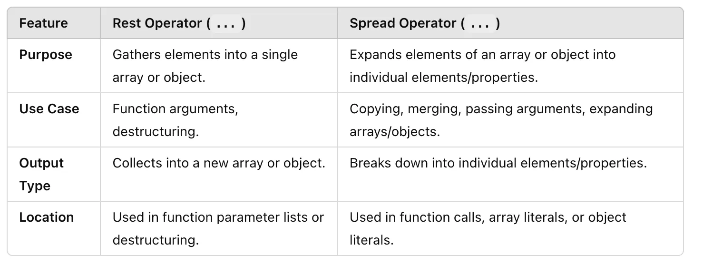

## Rest Vs Spread
The rest operator (…) and the spread operator (…) in JavaScript look the same (three dots), but they serve different purposes depending on the context in which they are used. Here’s a detailed comparison:

### 1. Rest Operator
- Purpose: The rest operator collects multiple values into a single data structure (like an array or an object).
- Use Case: For function arguments or restructuring assignments. It “gathers” remaining elements.

- a. In Functions (Collecting Arguments): The rest operator collects all remaining arguments into an array.
```js

function sum(…numbers) {
return numbers.reduce((total, num) => total + num, 0);
}
console.log(sum(1, 2, 3, 4)); // Output: 10
```

- b. In Destructuring (Gather Remaining Properties): The rest operator collects the remaining elements into a 
new array or object.
```js
const [first, …rest] = [1, 2, 3, 4];
console.log(first); // Output: 1
console.log(rest); // Output: [2, 3, 4]
const { a, …others } = { a: 1, b: 2, c: 3 };
console.log(a); // Output: 1
console.log(others); // Output: { b: 2, c: 3 }
```
### 2. Spread Operator

- Purpose: The spread operator expands an array, object, or iterable into individual elements or properties.
- Use Case: For copying, merging, or passing values as arguments. It “spreads” elements out.
- a. Expanding Arrays: The spread operator expands the elements of an array into individual elements.
```js
const arr1 = [1, 2, 3];
const arr2 = […arr1, 4, 5];
console.log(arr2); // Output: [1, 2, 3, 4, 5]
```
- b. Expanding Objects: The spread operator copies properties from one object to another or combines multiple objects.
```js
const obj1 = { a: 1, b: 2 };
const obj2 = { …obj1, c: 3 };
console.log(obj2); // Output: { a: 1, b: 2, c: 3 }
```
- c. Passing as Function Arguments: The spread operator expands elements of an array into individual arguments.
```js
function multiply(x, y, z) {
return x * y * z;
}
const nums = [2, 3, 4];
console.log(multiply(…nums)); // Output: 24
```
### Key Differences:


### Combined Example:
```js
function combineArrays(first, ...rest) {
  // Rest operator gathers the remaining arguments into an array
  const combined = [first, ...rest]; // Spread operator expands `rest` into individual elements
  return combined;
}

console.log(combineArrays(1, 2, 3, 4)); // Output: [1, 2, 3, 4]
```
### In short:

**Rest**: Gathers multiple elements into one structure.

**Spread**: Breaks one structure into multiple elements.