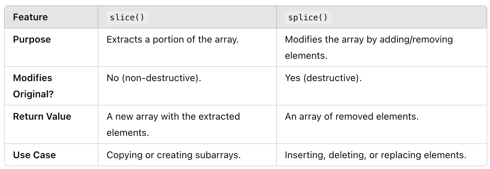

## Slice Vs Splice
### slice
Creates a new array by copying a portion of the original array without modifying the original array.
#### Syntax:
```js
array.slice(start, end) //
```
- start (optional): The index to begin extraction (inclusive). Defaults is 0 if omitted.
- end (optional): The index to stop extraction (exclusive). Defaults is array's length if omitted.
#### Example:
```js
const arr = [1, 2, 3, 4, 5];
// Extract elements from index 1 to 3 (3 is not included)
const sliced = arr.slice(1, 3);
console.log(sliced); // Output: [2, 3]
// Original array remains unchanged
console.log(arr); // Output: [1, 2, 3, 4, 5]
```
#### Key Notes:
You can use negative indices in slice():
```js
const arr = [1, 2, 3, 4, 5]; 
console.log(arr.slice(-3)); // Output: [3, 4, 5]
```
**Usage**: Often used for copying or creating subarrays.

### splice()
Adds, removes, or replaces elements in an array in place. It Modifies the original array.
#### Syntax:
```js
array.splice(start, deleteCount, item1, item2, ...)
```
- start: The index at which to begin changing the array.
- deleteCount (optional): The number of elements to remove starting from start.
- item1, item2, ... (optional): Elements to add to the array at the start index.

#### Examples:
- **Removing Elements:**
```js
const arr = [1, 2, 3, 4, 5];
const removed = arr.splice(1, 2);
console.log(removed); // Output: [2, 3]
console.log(arr);     // Output: [1, 4, 5]
```
- **Adding Elements:**
```js
const arr = [1, 4, 5];
arr.splice(1, 0, 2, 3); // Add elements at index 1
console.log(arr); // Output: [1, 2, 3, 4, 5]
```
- **Replacing Elements:**
```js
const arr = [1, 2, 3, 4, 5];
// Replace 2 elements starting from index 1
arr.splice(1, 2, 6, 7);
console.log(arr); // Output: [1, 6, 7, 4, 5]
```
#### Key Differences:

